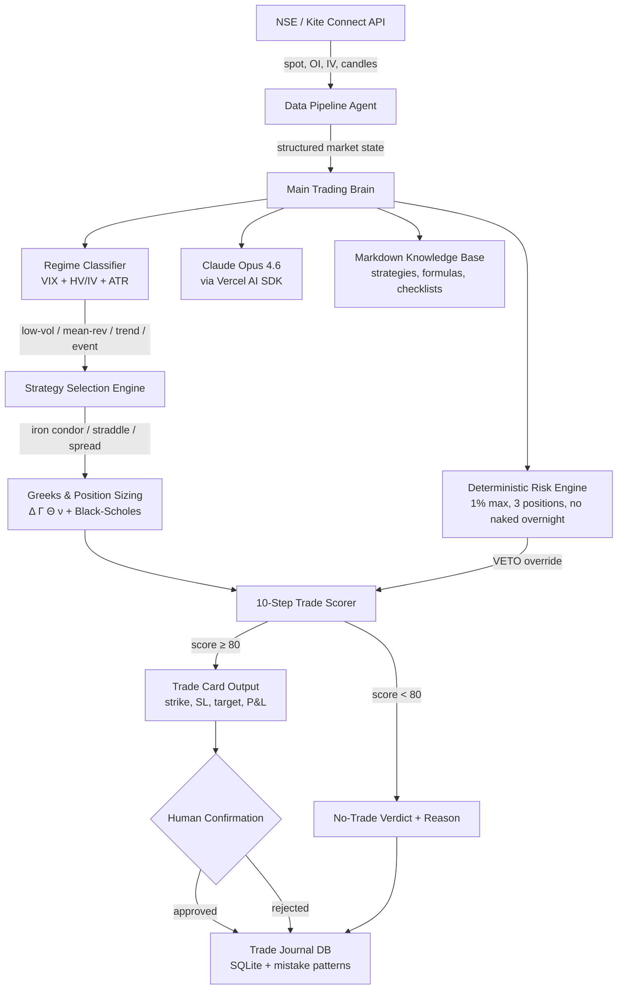

<div align="center">

  

  <h1>🌈 Indradhanush — Agent Trading</h1>

  <p><em>Built to be brave and disciplined.</em></p>

  <p><strong>An AI-native quantitative trading intelligence system purpose-built for NSE index derivatives — BANKNIFTY, NIFTY, FINNIFTY — combining Black-Scholes Greeks computation, implied volatility surface modeling, regime-aware strategy synthesis, and deterministic risk management into a single, local-first decision engine that never places a trade without human confirmation.</strong></p>

  [](https://opensource.org/licenses/Apache-2.0)
  [](https://www.typescriptlang.org/)
  [](https://anthropic.com)
  [](https://www.nseindia.com/)
  [](https://www.nseindia.com/)
  [](http://makeapullrequest.com)

</div>

<hr/>

## 📜 The Foreword

> **A short, personal note before the blueprint begins.**

Rainbow, this document is your trading brain on paper. It is not a typical product spec. It is a single instruction set for Claude Code that captures everything you have planned: the philosophy, the architecture, the agents, the math, the risk rules, the dashboard, the database, and the workflow.

Two earlier blueprints existed. The first focused on a private trading terminal for the Indian market. The second focused on a modular AI operating system where trading is the priority but travel and mindset projects can use the same architecture later. Both views are correct. They look at the same plan from two different angles.

This document is the union of both. Where they overlapped, the stronger phrasing was kept. Where they differed, both views are presented so Claude Code can build a system that satisfies both.

> ### 💬 Core Principle
> *"A trading agent that says no-trade with confidence is more valuable than a trading agent that says buy with hope."*

**Read this like this:**
- **Parts I–IV** tell Claude Code *why* the system exists and how to think about it.
- **Parts V–IX** tell Claude Code *what* to build — agents, math, workflows, frontend, memory.
- **Parts X–XV** tell Claude Code *how* to build it — phases, run, test, deploy, prompts, examples.

> [!CAUTION]
> **A Note on Safety** — No real orders are placed automatically in V1. Manual confirmation is required before any trade. Risk rules are deterministic and override AI opinion. The agent must reject more trades than it suggests. A no-trade verdict is professional, not failure.

---

## 📊 Executive Summary

A quantitative options research and decision-support system engineered exclusively for **NSE index derivatives** — BANKNIFTY, NIFTY, and FINNIFTY — built on premium-selling strategies, Greeks-driven position sizing, and volatility regime classification.

The system ingests real-time and EOD market data from Kite Connect and NSE official feeds, computes a full option chain analysis (Delta, Gamma, Theta, Vega, IV percentile, IV rank, PCR, max pain, OI buildup), classifies the current volatility regime (low-vol crush, mean-reversion, trending, event-driven), runs each trade idea through a deterministic ten-step scoring pipeline, applies hard risk limits (max 1% capital per trade, max 3 concurrent positions, no overnight naked shorts), and produces a structured trade recommendation with exact strikes, entry/exit levels, stop-loss, target, and expected P&L — all before a human confirms or rejects.

The brain is Claude Opus. The math is Black-Scholes with Heston stochastic vol adjustments. The risk engine is deterministic and overrides AI opinion. The memory is a local database of every decision, every mistake pattern, every regime transition. Nothing goes to the cloud. Nothing trades without you.

<table>
  <tr>
    <td align="center"><h3>100%</h3><strong>LOCAL FIRST</strong><br/>No cloud needed for V1</td>
    <td align="center"><h3>0</h3><strong>AUTO TRADES</strong><br/>Manual confirm only</td>
    <td align="center"><h3>1%</h3><strong>DEFAULT RISK</strong><br/>Per trade of capital</td>
    <td align="center"><h3>80+</h3><strong>TRADE SCORE</strong><br/>Min to consider entry</td>
  </tr>
</table>

---

## 🔍 What It Is. What It Is Not.

> Two columns. Read both before writing a single line of code.

<table>
  <tr>
    <th>✅ IS</th>
    <th>❌ IS NOT</th>
  </tr>
  <tr>
    <td>A guided intelligence system that follows the user's rules, workflows, and knowledge base.</td>
    <td>It is <strong>not</strong> a magic money machine.</td>
  </tr>
  <tr>
    <td>A modular AI agent architecture using Claude, Claude Code, Cursor, Python, markdown files, and APIs.</td>
    <td>It is <strong>not</strong> a guaranteed profitable trading system.</td>
  </tr>
  <tr>
    <td>A system that reads local knowledge files, gathers data, reasons on a defined workflow, and saves logs.</td>
    <td>It is <strong>not</strong> a fully autonomous AI controlling the Mac without permissions.</td>
  </tr>
  <tr>
    <td>For trading: a quant-style options research and decision-support platform with risk-first logic.</td>
    <td>It is <strong>not</strong> a system that should execute real trades before extensive testing.</td>
  </tr>
  <tr>
    <td>A repeatable framework that can be adapted to travel planning, research, and personal growth later.</td>
    <td>It is <strong>not</strong> one giant prompt or one giant markdown file. It must be modular.</td>
  </tr>
</table>

---

## 🌟 Key Features

### Options Analytics & Greeks Engine
- **Full Option Chain Decomposition** — Real-time Delta (Δ), Gamma (Γ), Theta (Θ), Vega (ν) computation for every strike across BANKNIFTY, NIFTY, and FINNIFTY weekly/monthly expiries.
- **IV Surface Modeling** — Implied volatility percentile, IV rank, volatility smile/skew analysis, term structure visualization, and IV crush detection around events (RBI policy, earnings, expiry).
- **Max Pain & OI Analysis** — Max pain calculation, Put-Call Ratio (PCR) tracking, OI buildup/unwinding detection, and smart money flow inference from change-in-OI patterns.

### Volatility Regime Classification
- **Four-Regime Model** — Automatically classifies market into low-vol crush, mean-reversion, trending, or event-driven regimes using India VIX, historical vs implied vol spread, and ATR-based momentum.
- **Regime-Aware Strategy Selection** — Iron condors in low-vol, straddle sells in mean-reversion, directional spreads in trending, hedged positions in event-driven. Strategy adapts to regime, not the other way around.

### Quantitative Decision Pipeline
- **Ten-Step Scoring System** — Every trade idea passes through: regime check → IV percentile filter → strike selection → Greeks validation → risk/reward ratio → position sizing → correlation check → max drawdown estimate → score calculation → human confirmation. Score below 80 = automatic reject.
- **Premium Decay Mathematics** — Theta decay curves, time-to-expiry optimization, and premium-selling edge calculation calibrated to NSE's weekly expiry cycle.

### Deterministic Risk Engine
- **Hard Limits That Override AI** — Max 1% capital risk per trade. Max 3 concurrent positions. No naked short selling overnight. No position through unknown events. Margin utilization capped at 60%.
- **Stop-Loss & Target Automation** — Pre-calculated stop-loss at 1.5x premium received, target at 50% premium capture. Trailing stops activate at 30% profit.
- **Drawdown Circuit Breaker** — If daily P&L hits -2%, all new entries frozen. If weekly drawdown exceeds -5%, system enters review-only mode.

### Market Data & Intelligence
- **NSE Native Data Pipeline** — Kite Connect API for real-time quotes, historical candles, and order flow. NSE official feeds for EOD bhavcopy, FII/DII data, and bulk/block deals.
- **Scheduled Collection** — Pre-market data pull at 9:00 AM, intraday snapshots every 15 minutes during market hours, EOD aggregation at 3:35 PM, post-market report generation at 4:00 PM.

### Memory, Journal & Pattern Recognition
- **Trade Journal Database** — Every entry, exit, reasoning, regime, IV at entry, Greeks snapshot, P&L, and mistake classification stored in a local SQLite database.
- **Mistake Pattern Detection** — Tracks recurring errors (chasing momentum, ignoring regime, oversizing) and surfaces warnings when similar conditions reappear.
- **Daily & Weekly Reports** — Automated P&L summary, win rate, average RR, regime accuracy, and performance attribution by strategy type.

### Monte Carlo Backtesting
- **Realistic Cost Modeling** — Includes NSE transaction charges, STT, SEBI turnover fees, GST, stamp duty, and slippage estimates calibrated to BANKNIFTY liquidity.
- **Multi-Regime Testing** — Backtests run separately across each volatility regime to prevent survivorship bias from a single favorable period.
- **Monte Carlo Simulation** — 10,000-path simulation for expected drawdown, CAGR distribution, and probability of ruin across strategy variants.

---

## 📚 Table of Contents

> **Fifteen parts, sixty topics, one system.**

| # | Part | What It Covers |
|---|------|---------------|
| I | Vision & Philosophy | why this exists and what it must never become |
| II | System Architecture | the layered model and the data flow |
| III | Knowledge & Context | the docs, the markdown brain, agent file format |
| IV | Data Sources & APIs | kite, global feeds, news, scheduled collection |
| V | The Agent System | main brain plus nine specialist agents |
| VI | Quant Trading Intelligence | math, formulas, premium-selling reality |
| VII | Workflow & Decisioning | the ten-step decision pipeline and scoring |
| VIII | Risk Engine | deterministic rules that override the AI |
| IX | Frontend & Dashboard | terminal layout, system health, design system |
| X | Memory & Journal | database schema, daily report, mistake patterns |
| XI | Backtesting Standards | realistic costs, multi-regime testing |

---

## 🏗️ Architecture

### The AI-OS — One Architecture, Many Domains

> *Trading is the priority. Travel and Mindset use the same chassis later.*

The same architecture is reused across three Claude Projects so that knowledge cannot leak between domains. Trading rules must never contaminate a travel plan. Mindset journaling must never bleed into a trade decision. Each project gets its own instructions and its own knowledge files. The codebase is shared. The reasoning context is strictly partitioned.

| Project | Priority | Purpose |
|---------|----------|---------|
| **Trading System** | Priority 1 | Indian options, quant research, risk, backtesting, live data later. |
| **Travel Planner** | Priority 2 | Budget travel, smart routes, flight/hotel/trekking, itineraries. |
| **Mindset & Growth** | Priority 3 | Reflection, decision-making, discipline, productivity, confidence. |

> [!IMPORTANT]
> **Why Three Projects, Not One** — Prevents trading rules from contaminating travel or mindset chats. Keeps Claude focused on the current domain, with cleaner context. Each project has its own role instructions and its own files. Trading is built first. The other two prove the architecture is reusable.

---

### The Design Philosophy

> A deterministic layered model that separates market intelligence from trade execution.

The system never guesses. It receives a market state (spot price, IV surface, OI map, regime classification), loads the relevant strategy rules for that regime, runs quantitative filters (IV percentile > 60 for premium sells, PCR between 0.8–1.3 for neutral strategies), computes exact position sizing from Greeks and capital limits, scores the trade through 10 deterministic checkpoints, and only surfaces a recommendation if the score exceeds 80. Below 80 is an automatic no-trade. The result, whether trade or no-trade, is logged with full reasoning.

```
  ┌────────────┐  ┌────────────┐  ┌──────────────┐  ┌─────────────┐  ┌────────────┐  ┌─────────────┐  ┌──────────┐  ┌────────────┐
  │ Market     │→ │ Regime     │→ │ Strategy     │→ │ Greeks &    │→ │ 10-Step    │→ │ Trade Card  │→ │ Journal  │→ │ Post-Trade │
  │ State      │  │ Classifier │  │ Rules        │  │ Risk Calc   │  │ Scoring    │  │ or No-Trade │  │ + Log    │  │ Review     │
  └────────────┘  └────────────┘  └──────────────┘  └─────────────┘  └────────────┘  └─────────────┘  └──────────┘  └────────────┘
```

---

### The Three-Layer Instruction System

> Where rules live decides whether they help or hurt. This is the most important confusion to clear up.

The correct setup uses three layers — each with a different scope and a different lifetime. Global settings stay general. Project instructions define a role. Markdown files carry the deep knowledge. Trading-specific rules must **not** live in global settings, because the same Claude account also drives the Travel and Mindset projects.

```
┌─────────────────────────────────────────────────────────┐
│  🌐 GLOBAL — Claude Settings                           │
│  General behavior: clear, structured, truthful,         │
│  challenges weak assumptions.                           │
│                                                         │
│  ┌───────────────────────────────────────────────────┐  │
│  │  🟣 PROJECT — Project Instructions                │  │
│  │  Domain identity: Trading / Travel / Mindset      │  │
│  │  role and tone.                                   │  │
│  │                                                   │  │
│  │  ┌─────────────────────────────────────────────┐  │  │
│  │  │  🔴 FILES — Markdown Knowledge Base         │  │  │
│  │  │  Deep rules, strategies, formulas,          │  │  │
│  │  │  checklists, examples.                      │  │  │
│  │  └─────────────────────────────────────────────┘  │  │
│  └───────────────────────────────────────────────────┘  │
└─────────────────────────────────────────────────────────┘
```

**Rule of Thumb:**
- **Global Custom Instructions** — clear, structured, practical, truthful, challenge weak assumptions.
- **Project Instructions** — domain identity. Trading project = quant-style options assistant for NSE.
- **Markdown Files** — quant logic, risk rules, workflow, strategies, checklists. The deep knowledge lives here.

---

### System Architecture Diagram



---

## 🚀 Quickstart

Follow these instructions to get your local development environment up and running quickly.

### 1. Prerequisites

- **Node.js**: `v18.0.0` or higher.
- **npm** or **yarn** or **pnpm**.
- **Composio CLI**: Installed globally or via `npx`.

### 2. Installation

Clone the repository and install the dependencies:

```bash
git clone https://github.com/indradhanushreddy95-ux/Indradhanush_Trading_Intelligence.git
cd Indradhanush_Trading_Intelligence
npm install
```

### 3. Configuration

You must set up your environment variables before running the agent.

1. Copy the example `.env` file:
   ```bash
   cp .env.example .env
   ```
2. Open `.env` and add your required keys:
   ```env
   ANTHROPIC_API_KEY="your_anthropic_api_key_here"
   # Other necessary keys defined in .env.example
   ```

### 4. Authenticate Composio

Link your GitHub account to the Composio toolset:

```bash
npx composio add github
```

### 5. Start the Agent

Run the main application:

```bash
npm start
```
*Note: This utilizes `tsx` to execute the TypeScript files directly.*

---

## 🤝 Contributing

We welcome contributions of all sizes! To ensure a smooth process:
1. Please read our [Contributing Guidelines](CONTRIBUTING.md) to understand our workflow.
2. If you find a bug or have a feature request, please use the provided templates in our [Issue Tracker](../../issues).

## 📄 License

This project is licensed under the **Apache License 2.0**. See the [LICENSE](LICENSE) file for details.

---

<div align="center">
  <em>For Rainbow · Built to be brave and disciplined.</em>
  <br/><br/>
  <strong>🌈 Indradhanush — Agent Trading</strong>
</div>
