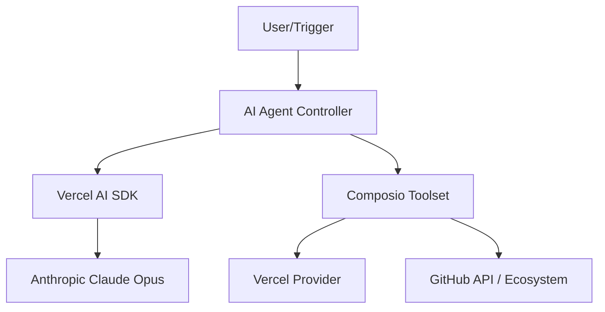

<div align="center">
  
  <h1>AI Quant Trading Agent</h1>
  <p><strong>A multi-agents AI trading intelligence, Built on a hub-and-spoke architecture with seven specialist agents engineered for Indian derivatives trading, integrating real-time market data ingestion, option chain analytics, volatility regime detection, Monte Carlo backtesting. Real-time data pipelines, regime-aware strategy synthesis, and Greeks-based quantitative modeling.</strong></p>

  [](https://opensource.org/licenses/Apache-2.0)
  [](https://www.typescriptlang.org/)
  [](http://makeapullrequest.com)
  [](https://composio.dev)

</div>

<hr/>

## 📖 Overview

The **AI Quant Trading Agent** is a next-generation AI automation tool. Built on top of the robust [Composio](https://composio.dev/) platform and the Vercel AI SDK, this agent leverages Anthropic's state-of-the-art **Claude 3 Opus** (`claude-opus-4-6`) to execute highly complex developer tasks, manage repositories, and interact with the GitHub ecosystem—all autonomously.

### 🌟 Key Features

- **Autonomous Workflows**: Let Claude intelligently execute multi-step operations using Composio's toolsets.
- **Deep GitHub Integration**: Out-of-the-box support for extensive GitHub actions (PRs, Issues, Code review).
- **Vercel AI SDK Support**: Seamless, edge-ready performance utilizing `@ai-sdk/anthropic`.
- **TypeScript First**: Strictly typed, robust, and highly maintainable codebase.

## 🏗️ Architecture



## 🚀 Quickstart

Follow these instructions to get your local development environment up and running quickly.

### 1. Prerequisites

- **Node.js**: `v18.0.0` or higher.
- **npm** or **yarn** or **pnpm**.
- **Composio CLI**: Installed globally or via `npx`.

### 2. Installation

Clone the repository and install the dependencies:

```bash
git clone https://github.com/indradhanushreddy95-ux/composio-ai-agent.git
cd composio-ai-agent
npm install
```

### 3. Configuration

You must set up your environment variables before running the agent.

1. Copy the example `.env` file:
   ```bash
   cp .env.example .env
   ```
2. Open `.env` and add your required keys:
   ```env
   ANTHROPIC_API_KEY="your_anthropic_api_key_here"
   # Other necessary keys defined in .env.example
   ```

### 4. Authenticate Composio

Link your GitHub account to the Composio toolset:

```bash
npx composio add github
```

### 5. Start the Agent

Run the main application:

```bash
npm start
```
*Note: This utilizes `tsx` to execute the TypeScript files directly.*

## 🤝 Contributing

We welcome contributions of all sizes! To ensure a smooth process:
1. Please read our [Contributing Guidelines](CONTRIBUTING.md) to understand our workflow.
2. If you find a bug or have a feature request, please use the provided templates in our [Issue Tracker](../../issues).

## 📄 License

This project is licensed under the **Apache License 2.0**. See the [LICENSE](LICENSE) file for details.

---
<div align="center">
  <i>Built with ❤️ for the open-source community.</i>
</div>
